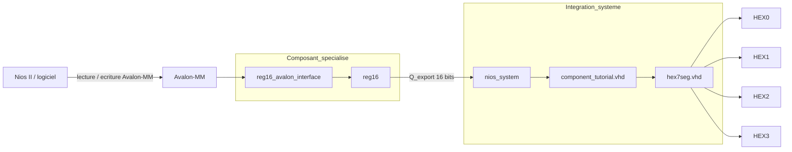

# DE1 Basic Computer - V0

Ce depot contient la version V0 du projet, avec une structure aplatie a la racine et le contenu VHDL directement visible dans GitHub.
L'objectif de cette version est de montrer comment on construit un composant specialise, comment on le transforme en IP core reutilisable, puis comment on l'integre dans un systeme Nios II via Avalon/MM.

## Objectif final

Le but du travail est d'avoir un composant materiel simple mais complet, capable de :

1. stocker une valeur 16 bits dans un registre dedie;
2. rendre ce registre accessible depuis un bus Avalon/MM;
3. exposer la valeur vers le systeme Nios;
4. afficher cette valeur sur les afficheurs 7 segments de la carte DE1.

Autrement dit, on ne fait pas seulement un module VHDL isole. On fabrique un vrai bloc materiel integrable dans un systeme sur FPGA, avec une interface bus standard et une sortie exploitable par le top-level.

## Notions importantes

### IP core

Un IP core est un bloc fonctionnel predefini ou dessine par l'utilisateur, que l'on peut reutiliser dans un systeme plus grand.
Dans ce projet, `reg16` devient un IP core parce qu'il ne sert pas juste comme un registre interne: il est enveloppe par `reg16_avalon_interface`, exporte dans `nios_system`, puis raccorde au reste du design.

### Composant specialise

Un composant specialise est un bloc concu pour un besoin precis du projet.
Ici, le composant specialise n'est pas un registre generique quelconque: il est pense pour fonctionner dans l'architecture DE1 + Nios II + Avalon/MM, avec :

- une largeur fixe de 16 bits;
- un reset synchrone au systeme;
- un controle par `byteenable`;
- une sortie exportee pour le systeme global.

### Interface Avalon/MM

Avalon Memory-Mapped est le bus utilise pour relier le processeur Nios aux peripheriques materiels.
L'interface Avalon/MM sert a traduire les signaux du bus en operations de lecture/ecriture vers notre composant.

## Architecture generale

Le design repose sur quatre couches logiques :

1. `reg16` : le coeur du composant, qui stocke la valeur 16 bits.
2. `reg16_avalon_interface` : l'adaptateur entre le bus Avalon/MM et le registre.
3. `nios_system` : le systeme Nios II genere sous Qsys/Platform Designer.
4. `component_tutorial.vhd` + `hex7seg.vhd` : le top-level de la carte et l'affichage sur les HEX.

## Schema complet

## Comment le composant a ete cree

### 1. Creation du registre de base

Le fichier `ip_module/reg16/reg16.vhd` implemente un registre 16 bits synchrone.
Il fonctionne sur front montant de l'horloge et utilise `byteenable` pour autoriser l'ecriture octet par octet.

Comportement principal :

- si `resetn = '0'`, alors `Q` est remis a zero;
- si `byteenable(0) = '1'`, l'octet de poids faible est charge;
- si `byteenable(1) = '1'`, l'octet de poids fort est charge.

Ce choix est important car il permet au composant de se comporter comme un vrai bloc de memoire/micro-peripherique simple, compatible avec une ecriture partielle depuis le bus.

### 2. Ajout de l'interface Avalon/MM

Le fichier `ip_module/reg16/reg16_avalon_interface.vhd` encapsule `reg16` pour le rendre utilisable dans Qsys/Platform Designer.

Cette couche fait le lien entre le bus et le registre :

- `writedata` alimente l'entree `D`;
- `chipselect` et `write` valident l'ecriture;
- `byteenable` pilote les octets;
- `readdata` renvoie l'etat du registre;
- `Q_export` expose la valeur du registre vers l'exterieur du systeme.

L'interet de cette couche est d'isoler la logique interne du registre de la logique de communication bus. On garde ainsi un coeur simple, puis on ajoute l'adaptation necessaire pour l'integration systeme.

### 3. Integration dans le systeme Nios

Le systeme `nios_system` a ete genere autour du composant exporte `Q_export`.
Dans le top-level `component_tutorial.vhd`, le signal `to_HEX` recupere `to_hex_export` de `nios_system`.

Ensuite, `hex7seg` decompose `to_HEX` en 4 digits de 4 bits :

- `to_HEX(3 downto 0)` -> `HEX0`
- `to_HEX(7 downto 4)` -> `HEX1`
- `to_HEX(11 downto 8)` -> `HEX2`
- `to_HEX(15 downto 12)` -> `HEX3`

`component_tutorial.vhd` fait donc le role de surface d'assemblage finale: il relie le systeme Nios au monde exterieur de la carte.

## Lecture du flux de donnees

Le parcours de la valeur 16 bits est le suivant :

1. le processeur Nios ecrit une valeur dans l'espace Avalon/MM;
2. `reg16_avalon_interface` traduit cette ecriture en commande interne;
3. `reg16` stocke la valeur 16 bits;
4. `Q_export` expose cette valeur hors du composant;
5. `component_tutorial.vhd` la recupere via `to_hex_export`;
6. `hex7seg.vhd` convertit chaque quartet en segments 7 segments;
7. les afficheurs `HEX0..HEX3` affichent la valeur hexadecimale.

## Fichiers importants

- `component_tutorial.vhd` : top-level de la carte DE1.
- `hex7seg.vhd` : decodeur pour les afficheurs 7 segments.
- `ip_module/reg16/reg16.vhd` : registre 16 bits de base.
- `ip_module/reg16/reg16_avalon_interface.vhd` : wrapper Avalon/MM du registre.
- `nios_system.qsys` : configuration du systeme Nios et de ses peripheriques.

## Ce qu'on a appris

Cette V0 montre qu'un composant specialiste ne se resume pas a une simple entite VHDL.
Pour qu'il soit vraiment reutilisable dans un FPGA avec processeur, il faut penser :

- a la logique fonctionnelle interne;
- a l'interface de communication avec le bus;
- a l'export de signaux vers le systeme;
- au top-level qui relie le composant au reste de la carte.

En pratique, le projet illustre la chaine complete: conception du coeur VHDL, encapsulation en IP core, integration dans Nios, puis validation par affichage sur les HEX.

